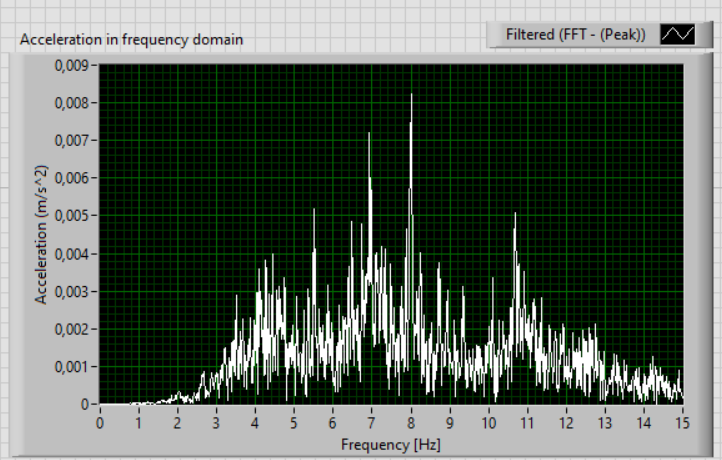
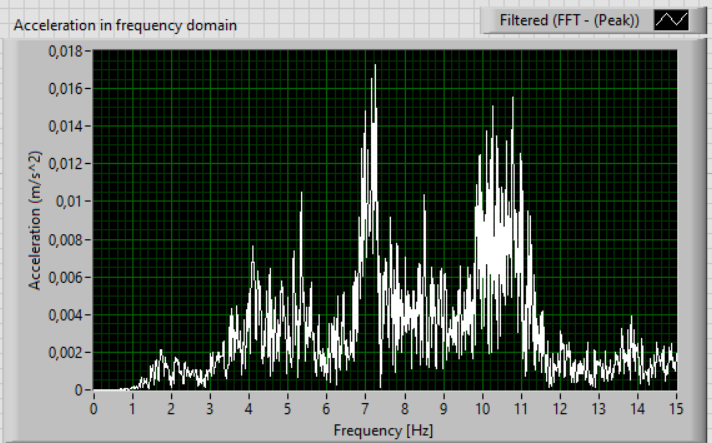
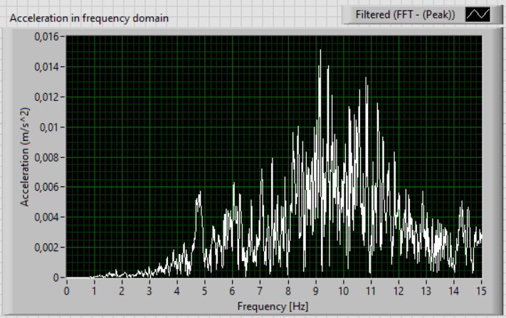

# Biomechanical Signal Processing & Data Analysis
This repository focuses on the analytical side of biomedical engineering: from raw data acquisition to the extraction of clinical and ergonomic indicators. It covers signal processing, statistical modeling, and machine learning applications to evaluate human movement and environmental comfort.

## 🛠 Tech Stack
* Softwares: MATLAB, Labview

* Tools: Signal Processing Toolbox, Statistics 

* Methods: FFT Analysis, Digital Filtering (Butterworth), K-Nearest Neighbors (K-NN), Linear Regression, Hysteresis Modeling.
  

## 📂 Featured Projects
**1. Exploring Subway Comfort: A Comparison of Milan’s Metro Lines**

* An ergonomic and vibrational study comparing the Red (M1), Green (M2), and Blue (M4) lines of the Milan subway system.

* Objective: Quantify passenger comfort through vibration analysis and signal processing.

* Analysis:
     * Comparison of frequency spectra across different lines and train generations.

     * Identification of critical vibrational peaks affecting passenger fatigue and comfort.

     * Data-driven evaluation of the newer M4 line's performance compared to legacy infrastructure.
   

  <table border="0">
    <tr>
      <td align="center">
        
         
        <em>Blu Line</em>
      </td>
      <td align="center">
        
         
        <em>Red Line</em>
      </td>
      <td align="center">
        
         
        <em>Green Line</em>
    </tr>
  </table>

   
  

    <em><strong>Figure 1:</strong> The Spectrum of z-acceleration of the three metro lines investigated.</em>
  

The analysis of the acceleration spectrum along the z-axis is essential to analyze the discomfort experienced in each line. The highest magnitudes of the peaks and the range of frequencies within are located, lead to the conclusion that the green and red line seem to be less comfortable with respect the new Blu line (M4).
 
**2. Human Gait Analysis & Classification**
* Analysis of kinematic data to characterize human walking patterns and identify anomalies.
 

  
   
  <em><strong>Figure 2:</strong> Acceleration along the z axis of Subject 2</em>

 

* Gait Cycle Detection: Identification of heel strike, stance, and swing phases from accelerometer/gyroscopic data.
 

  
   
  <em><strong>Figure 2:</strong> Phases of the Walk cycle </em>

 

* Feature Extraction: Calculation of spatio-temporal parameters (cadence, step length, symmetry).

* Automatic Classification: Implemented a K-NN (K-Nearest Neighbors) algorithm to classify different gait patterns or activities, optimizing accuracy through training/test matrix validation.
 

**3. Structural Health Monitoring: Lower Limb Prosthesis**
* Data processing for the maintenance and safety of prosthetic components.

* Strain Analysis: Computed Maximum Strain Shift and Residual Strain Displacement from sensorized components.

* Energy Dissipation: Calculate the Hysteresis Area and Relative Hysteresis Area to evaluate material fatigue.

* Linear Modeling: Fitted regression models to predict component behavior under cyclic loading.
 

**4. Physiological Signal Extraction from Chest Movements**
* Objective: Non-invasive estimation of respiratory and cardiac parameters.

* Signal Processing: Advanced filtering to decouple respiratory rhythms from cardiac micro-movements.

* Classification: Automatic recognition of respiratory patterns (eupnea, tachypnea, apnea)

## 📈 Key Skills Demonstrated
* Spectral Analysis: Advanced use of FFT and PSD to move from time-domain to frequency-domain insights.

* Machine Learning: End-to-end implementation of classifiers (from matrix creation to performance testing).

* Experimental Reliability: Managing "real-world" noise in signals (e.g., subway vibrations or chest movements) to ensure data integrity.
